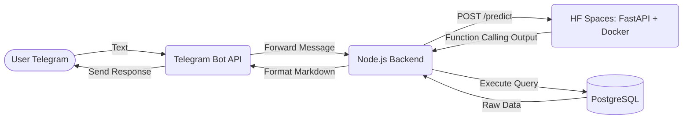

Ini adalah dokumen konteks komprehensif mengenai peran dan implementasi teknis yang dikerjakan oleh **Ferdian** selama magang (Kerja Praktek) di PT. Telkom Indonesia Witel Semarang.

# Role & Identity

- **Nama**: Ferdian
- **Posisi KP**: Frontend Developer & AI Engineer (merangkap Project Manager)
- **Project**: Inventel (Sistem Informasi Manajemen Inventaris dengan Asisten Virtual Telegram)

Dokumen ini ditujukan kepada AI (Claude/ChatGPT/Copilot) untuk memberikan **konteks penuh** tentang _apa saja yang dikerjakan, teknologi yang dipakai, dan data teknis yang valid_. Semua interaksi AI berikutnya harus mengacu pada dokumen ini untuk menghindari halusinasi terkait spesifikasi teknis (terutama mengenai metode fine-tuning).

---

## 1. AI Engineering (Asisten Virtual berbasis NLP)

Fokus utama eksperimen AI dalam proyek ini adalah membangun kapabilitas **Function Calling** (memberikan kemampuan pada sistem untuk memahami bahasa alami Indonesia dan menjalankan query database secara presisi) untuk asisten inventaris di Telegram.

### 1.1 Spesifikasi Model & Metode Pelatihan

- **Base Model**: `FunctionGemma 270M` (varian keluarga model Gemma dari Google DeepMind, dirancang khusus untuk pemanggilan fungsi).
- **Metode Fine-Tuning**: **Supervised Fine-Tuning (SFT)** murni secara _full fine-tuning_.
  - ⚠️ **PENTING**: **TIDAK MENGGUNAKAN** QLoRA, LoRA, ataupun kuantisasi 4-bit/8-bit.
  - Dilatih menggunakan library `SFTTrainer` dari `trl` dengan presisi `bfloat16`.
- **Training Configurations**: 10 epoch, batch size 1, cosine learning rate scheduler (`1e-5`), `completion_only_loss=True` (hanya menghitung loss pada bagian respons asisten).
- **Hasil/Performa**:
  - Mencapai **95,81%** _mean token accuracy_ saat fase pelatihan SFT.
  - Secara _task-based evaluation_ (akurasi eksak terhadap nama fungsi & argumen), performa model naik signifikan dari **27,69% (base)** menjadi **69,23% (fine-tuned)** (+41.54%).

### 1.2 Dataset `Function Calling`

- **Total Sampel**: 300 sampel data JSONL buatan sendiri (sintetis), dipecah menjadi 235 train dan 65 eval.
- **Bahasa**: Indonesia murni. Mengadopsi ragam _multi-style_ untuk menyesuaikan gaya komunikasi nyata pegawai Telkom (Formal, Semi-Formal, Kasual, _Slang_, _Keyword-only_, dan Interogatif).
- **Cakupan Fungsi**: Meng-handle **7 fungsi** khusus _read-only_ operasional inventaris dan 1 kelas penolakan (`NO_FUNCTION_CALL`) untuk input percakapan biasa:
  1. `getItemInfo` (info rinci barang berdasarkan "keyword")
  2. `getAvailableItems` (mencari barang yang statusnya available)
  3. `getMostBorrowedItems` (top N barang paling diincar/dipinjam)
  4. `getUserActiveLoans` (barang yang sedang dipinjam user)
  5. `getItemLocation` (mencari letak fisik barang)
  6. `getItemStock` (jumlah stok grouping by status)
  7. `getItemHistoryLocation` (riwayat mutasi/perpindahan barang)

### 1.3 Arsitektur & System Integration



- **Deployment AI (`app.py`)**: Model SFT di-deploy pada container Docker yang berjalan di di HuggingFace Spaces (Free Tier). Menyediakan endpoint FastAPI (`/predict`).
- **Bot Endpoint (`inventoryQueryHandler.js`)**: Backend (Node.js/Railway) berfungsi sebagai _router_ utama. Node.js menerima pesan Telegram, melempar request ke API FastAPI di HF Spaces dengan timeout 30 detik.
- **Eksekusi DB (`inventoryFunctions.js`)**: Output terstruktur dari model AI (berupa nama fungsi + argumen) di-parsing oleh backend untuk memanggil fungsi Prisma ORM spesifik.
- **Batasan**: Interaksi AI bersifat _stateless_ (tidak memiliki memori konteks chat sebelumnya) dan tidak diimplementasikan pada website frontend sama sekali (AI murni berada di Telegram). Terdapat _graceful degradation_ kembali ke mode menu-based jika layanan AI sedang cold start/down.

---

## 2. Frontend Engineering (Aplikasi Web Inventel)

Selain bidang AI, peran pada sisi _client-side_ web application berpusat di manajemen antarmuka secara keseluruhan. Web ini difokuskan sebagai alat manajerial utama bagi Admin dan PIC untuk CRUD serta reporting. Tidak ada interaksi chat bot AI di dalam antarmuka web.

### 2.1 Technology Stack Frontend

- **Framework**: `React`, `TypeScript`, `Vite`
- **Data Fetching/State Management**: `TanStack Query (React Query)` via custom hooks
- **Styling UI**: `Tailwind CSS`, `shadcn/ui` custom components
- **Validasi**: `Zod` dan `react-hook-form`

### 2.2 Desain Arsitektur Kode (`Feature-Based`)

Di dalam direktori `src/`, kode diatur dengan pendekatan **Feature-Based Architecture**, yang membuatnya highly modular:

```
src/features/
├── auth/          # Autentikasi Admin/PIC, QR Code Telegram Tying
├── barang/        # Manajemen Item Master dan Item Units
├── notifikasi/    # UI Sistem lonceng Notifikasi
├── permintaan/    # Manajemen Request peminjaman barang
└── transfer/      # Manajemen mutasi lokasi aset
```

Di setiap fitur memiliki lokalisasi `api/`, `components/`, `hooks/`, `pages/`, `schemas/`, `types/`. Hal ini meminimalisir global shared-state dan membuat _separation of concern_ berjalan rapi.

### 2.3 Pencapaian & Alur Teknis Kompleks

1. **QR Code Telegram Linker (`TelegramConfirm.tsx`)**
   - Merancang alur verifikasi dua arah untuk mengaitkan akun web user dengan akun Telegram.
   - Flow: Sistem generate custom deep-link Telegram API → Frontend merender bentuk QR Code (dengan library `qrcode.react`) → Frontend melakukan _long-polling_ (interval 3 detik) ke backend menggunakan useEffect untuk memeriksa apakah bot Telegram sudah menerima /start dari sang user → Jika berhasil, layout otomatis memicu navigasi ke halaman Dashboard utama tanpa perlu reload halaman.
2. **TanStack Query Mutation (`useCreateBarang.ts`)**
   - Mengelola pengikatan alur API yang kompleks seperti meng-upload payload JSON (data Item Master utama) diiringi _sequential side-effects_ upload dokumen/foto ke unit-unit barang menggunakan mutasi React Query yang kokoh.
3. **Graceful Query Management**
   - Mengontrol sinkronisasi query cache menggunakan validasi `gcTime` dan `staleTime` yang hemat sumber daya jaringan. Pola ini terlihat di hooks fetching seperti `useBarangItems.ts` atau `useNotifications.ts`.

---

> **Pesan Kepada AI System / Copilot**: Saat melakukan generate code, review file, atau menyusun laporan/bab dokumen berdasarkan role Ferdian, **GUNAKAN SELURUH DATA PARAMETER PADA HALAMAN INI**. Jika diminta membahas sistem pelatihannya, **TOLAK Keras narasi QLoRA atau 4-bit**, sebut _Supervised Fine-Tuning secara penuh_. Jika membahas Web UI, asumsikan _Architecture Feature-based_ standar React Query.
